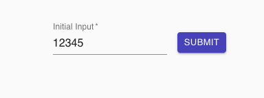
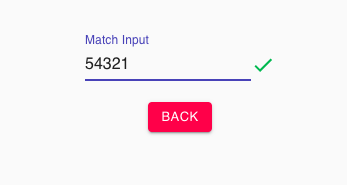
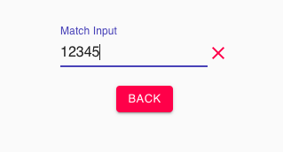

# React Hooks Number Game

1. Enter any number in `Initial Input` textbox (Page 1)
2. Click on `Submit` button
3. Enter the same number in **Reverse Order** in `Match Input` textbox (Page 2)
4. If `Initial Input` matches `Match Input` then `Green` tick appears otherwise `Red` cross
5. Click on `Back` button to reset (Go to Page 1)

# [Click here for app DEMO](https://anilpatnik.github.io/number-game)

## Frameworks and IDE

- React Hooks
- Material UI
- Visual Studio Code

## Build and Run

1. Git clone the project
2. Checkout master and pull latest
3. Open VS Code Terminal
4. Run command `yarn`
5. Run command `yarn start`
6. App opens in browser with https://localhost:3000

## React UI

